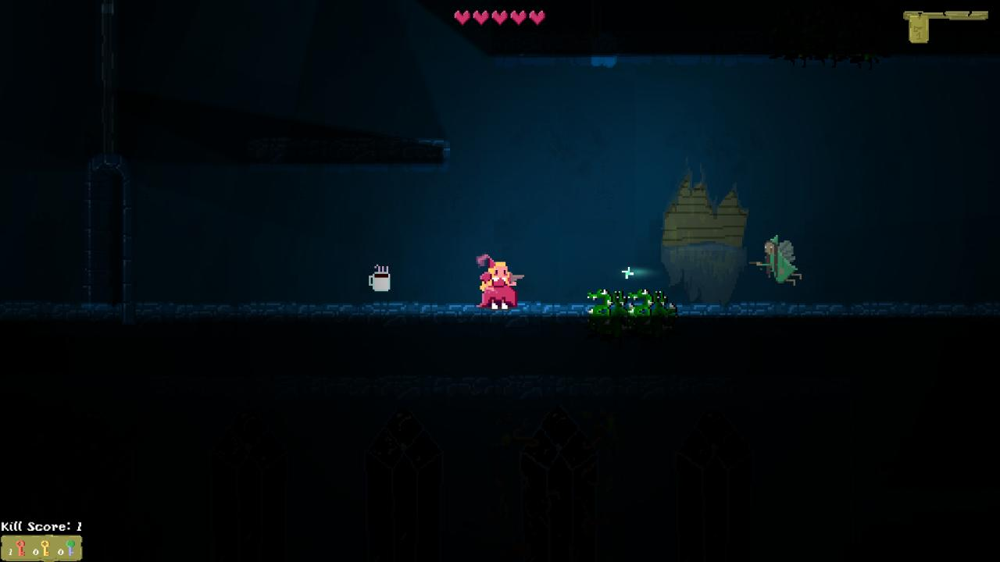

<h1>Sleeping Beauty wakes up</h1>
<h2>An explorative platformer game</h2>

When Sleeping Beauty wakes up after 100 years of sleep, she finds that no prince have accomplished to rescue her. She takes matter into her own hands. Armed with a magic wand, she sets out to find herself a way out, and escape the curse of the evil fairy godmother.

Sleeping Beauty now walks through the rooms of the enchanted castle, and has to find her way out. She looks for keys throughout the castle, to unlock doors and find her way out of the castle.

When she encounters the ghosts of the princes, they are angry with her, because they died while trying to rescue her. They don’t take no for an answer and she must shoot them in order to escape. When the princess destroys the ghosts, she gives the princes peace, free from an eternity of  haunting the castle.

<h3>Controls</h3>

- Navigate platforms (jump, left, right)
- Shoot (in the direction that she is facing)
- Collect items (by walking into them)
- Unlock doors (by walking into them)
- Change weapons (Roman, you decide what keys makes more sense)

<h3>View</h3>

- 2D side view with layers in a 3D depth
- Platformer (jumping around blocks)
- Maze-like level design (for an explorative aspect)
- Dynamic shadows and lighting

